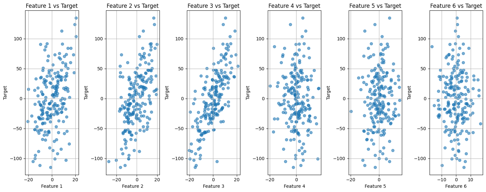
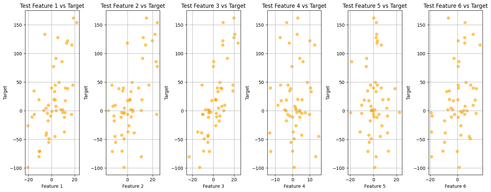
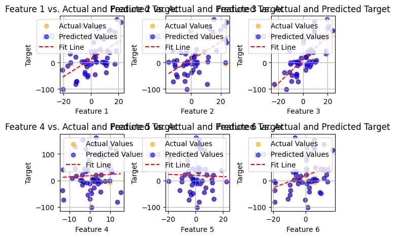
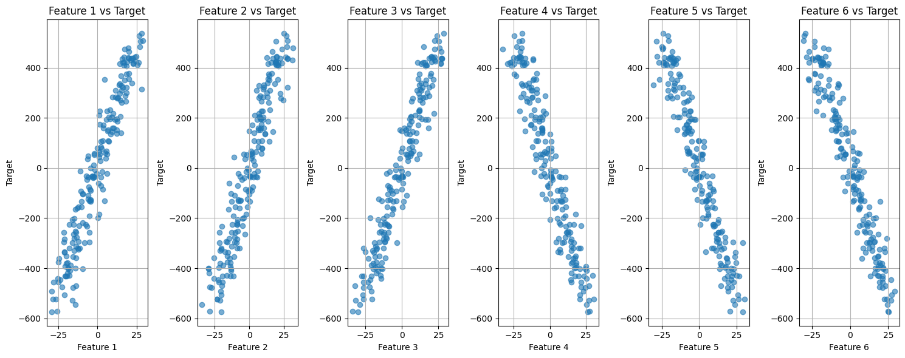
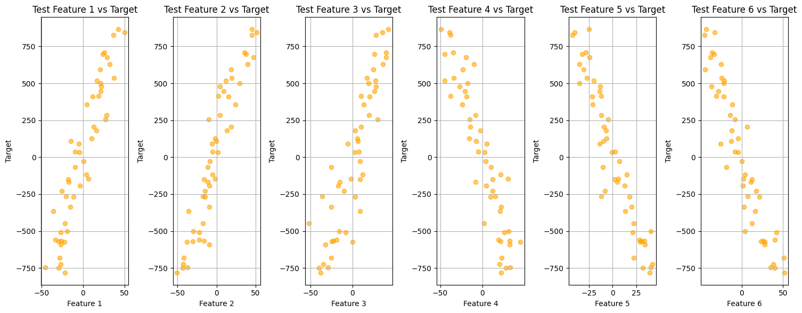
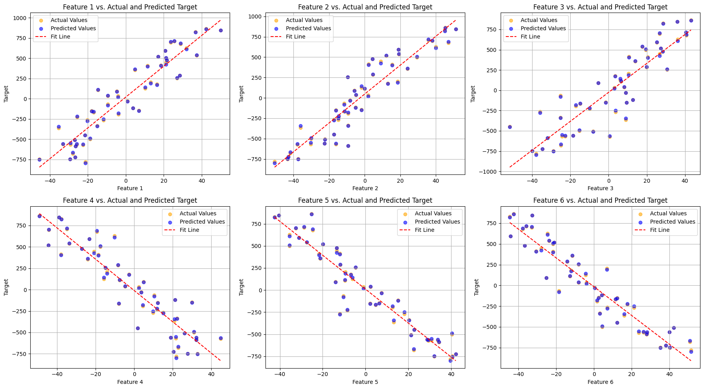

# Project 1

## Team Members:

- **Aakash Shivanandappa Gowda**  
  A20548984
- **Dhyan Vasudeva Gowda**  
  A20592874
- **Hongi Jiang**  
  A20506636
- **Purnesh Shivarudrappa Vidhyadhara**  
  A20552125

## 1. Overview

This project implements an **Elastic Net regression model** (ElasticNetModel) that combines L1 (Lasso) and L2 (Ridge) regularization techniques. It is designed to handle high-dimensional datasets, feature selection, and multicollinearity problems. The model uses **gradient descent** for optimization, function consists of the MSE loss, L1 loss, L2 loss.

## 2. Class and Function Descriptions

### `ElasticNetModel`

The `ElasticNetModel` class implements the Elastic Net regression model. Below are the key methods and their descriptions:

#### `__init__(self, lambdas=0.1, thresh=0.5, max_iter=1000, tol=1e-4, learning_rate=0.01)`

Initializes the Elastic Net model with the following parameters:

- **`lambdas`** (_float_, default=0.1): Penalty coefficient for regularization.
- **`thresh`** (_float_, default=0.5): Mixing parameter between L1 and L2 regularization. Value ranges from 0 to 1, where 0 means L1 regularization only and 1 means L2 regularization only.
- **`max_iter`** (_int_, default=1000): Maximum number of iterations for gradient descent.
- **`tol`** (_float_, default=1e-4): Tolerance for the stopping condition. If changes in weights are smaller than `tol`, training stops.
- **`learning_rate`** (_float_, default=0.01): Step size for gradient descent updates.

#### `fit(self, X, y)`

Trains the Elastic Net regression model using gradient descent on the provided feature matrix `X` and target values `y`.

- **Parameters**:
  - **`X`** (_numpy array_): Feature matrix of the training dataset (without intercept).
  - **`y`** (_numpy array_): Target values corresponding to the training dataset.
- **Returns**:
  - An instance of `ElasticNetResults`, containing the trained weight coefficients and intercept.

### `ElasticNetResults`

This class stores the results after training the Elastic Net model.

#### `predict(self, X)`

Predicts target values for the provided feature matrix `X`.

- **Parameters**:
  - **`X`** (_numpy array_): Feature matrix of the test dataset.
- **Returns**:
  - Predicted target values.

### Example Usage

```python
from elasticnet/models import ElasticNetModel

# Initialize the model
model = ElasticNetModel(lambdas=0.1, thresh=0.5, max_iter=1000, tol=1e-4, learning_rate=0.01)

# Fit the model on training data
model.fit(X_train, y_train)

# Predict on test data
predictions = model.predict(X_test)
```

### `generate_negative_data`

The `generate_negative_data` function generates synthetic data with two distinct patterns:

1. The first half of the features has a **monotonic increasing trend**.
2. The second half of the features has a **linear decreasing trend** (i.e., negative slope).

This function can be useful for testing model's ability in negative correlations data.

#### Parameters:

- **`range_x`** (_tuple_): The range of feature values (min, max).
- **`noise_scale`** (_float_): Standard deviation of the Gaussian noise added to the data.
- **`size`** (_int_): Number of samples in the dataset.
- **`num_features`** (_int_): Total number of features (half with increasing trend, half with decreasing trend).
- **`seed`** (_int_): Random seed for reproducibility.

#### Returns:

- **`X`** (_numpy array_): Generated feature matrix with both increasing and decreasing trends.
- **`y`** (_numpy array_): Target values with contributions from the features and added noise.

#### Example Usage:

```python
from generate_negative_regression_data import generate_negative_data

# Generate negative slope data
X, y = generate_negative_data(range_x=(0, 10), noise_scale=1.0, size=100, num_features=6, seed=42)
```

---

### `generate_rotated_positive_data`

The `generate_rotated_positive_data` function generates synthetic data with two patterns:

1. The first half of the features follows a **monotonic increasing trend**.
2. The second half exhibits a **wavy (S-shaped) pattern**, adjusted by a rotation matrix to create a slanted shape.

This function generates more complex data to test model's ability.

#### Parameters:

- **`range_x`** (_tuple_): Specifies the range of feature values (min, max).
- **`noise_scale`** (_float_): Standard deviation of the Gaussian noise added to the data.
- **`size`** (_int_): Number of samples in the dataset.
- **`num_features`** (_int_): Total number of features (half with increasing trend, half with a wavy pattern).
- **`seed`** (_int_): Random seed for reproducibility.
- **`rotation_angle`** (_float_, default=45): Angle (in degrees) to rotate the wavy pattern, introducing a slanted S-shape.
- **`mode`** (_int_, default=0): Determines the scaling factors for the feature values.

#### Returns:

- **`X`** (_numpy array_): Generated feature matrix with increasing trends and rotated S-shaped patterns.
- **`y`** (_numpy array_): Target values influenced by the features and noise.

#### Example Usage:

```python
from generate_positive_regression_data import generate_rotated_positive_data

# Generate positive data with rotation and S-shaped curves
X, y = generate_rotated_positive_data(range_x=(0, 10), noise_scale=1.0, size=100, num_features=6, seed=42, rotation_angle=45, mode=0)
```

## 1. Linear regression with ElasticNet regularization (combination of L2 And L1 regularization)

## Q1.What does the model you have implemented do and when should it be used?

### ElasticNetModel Overview

The model we've crafted, called **ElasticNetModel**, is an implementation of Elastic Net regression. What makes it special is that it not only uses MSE as the loss function, but also combines L1 (Lasso) and L2 (Ridge) regularization techniques. Here's a clearer view on how we implemented this model:

### Loss Function

- **The loss function consists of the MSE loss, L1 loss, and L2 loss. The loss function is shown as follows** :

$\text{Loss}$(w) = $\frac{1}{n}$ $\sum_{i=1}^{n}$ $(y_i - w^T x_i)^2$ + $\lambda$ ($\rho$ $\sum_{j=1}^{d}$ $|w_j|$ + (1 - $\rho$) $\sum_{j=1}^{d}$ $w_j^2$)

### Then use the gradient descent algorithm to calculate the gradient of the loss function and then update.

- **Gradient calculation results of MSE:** :

$\nabla_{\text{MSE}} = -\frac{2}{n} X^T (\hat{y} - y)$

- **Gradient calculation results of L1:**:

$\nabla_{\text{L1}} = \lambda_1 \cdot \text{sign}(w)$

- **Gradient calculation results of L2:** :

$\nabla_{\text{L2}} = 2 \cdot \lambda_2 \cdot w$

- **Total Gradient**:

$\nabla_{\text{Total}} = -\frac{2}{n} X^T (\hat{y} - y) + \lambda_1 \cdot \text{sign}(w) + 2 \cdot \lambda_2 \cdot w$

- **Weight Update**:

$w = w - \eta \cdot \nabla_{\text{Total}}$

$\eta \text{ is the learning rate, } \lambda_1 \text{ and } \lambda_2 \text{ are the penalty coefficients}$

### ElasticNetModel Overview

In summary, our model implements hybrid regularization by combining L1 and L2 penalties. This simplifies feature selection and improves model stability. Additionally, we uses gradient descent to efficiently update parameters and weights.

### What the Model Does:

_Hybrid Regularization:_ Elastic Net is unique because it utilizes both L1 and L2 penalties. The L1 penalty naturally eliminates lower importance variables, which essentially refines the model to focus on more important aspects, thus simplifying feature selection and interpretation. This is especially helpful when you have tons of potential predictors and want to keep a model that is not overfitted or one that cannot be interpreted. The L2 penalty is also useful when variables are correlated with each other, which happens often. This will occur by spreading the influence of those features more broadly so that the model stays stable and reliable.

_Gradient Descent Optimization:_ This is very useful in large datasets to optimize the model, where other methods would take too long. It slowly and systematically changes the model to find the perfect performance, based on how quick it is learning and how accurate we want our model.

### When to Use This Model:

_Broad Application Spectrum:_ It works best in any scenario requiring accurate and tough predictions. Great for things like Economics or Healthcare where the data and relationships can be pretty complex.

_Handling Complexity and Ensuring Accuracy:_ Great for understanding messy, complex data. From gene-centric analysis in the field of genomics to making sense of large-scale trends in powerful industries, this model is a way to juggle high-volume information without losing focus.

_Real-World Use Cases:_ In real estate, it can be used for predicting prices based on several factors (e.g., location, age) as well as through engineered features reflecting how the property compares to others. It may predict stock prices in finance by analyzing some economic metrics and company data.

The ElasticNetModel is not only used for predictions; it is also indispensable for understanding the data. It is beneficial not only for numbers but also for anyone who deals with complex data puzzles and draws smart conclusions. Researchers and analysts who often encounter difficult modeling scenarios find the power to simplify this model while dealing with complex relationships invaluable.

## Q2.How did you test your model to determine if it is working reasonably correctly?

We are testing and validating extensively to make our model not only accurate but also robust. So scrolling through, let us now see how it helps in providing a complete review of a model by each action described.

### Synthetic Data Generation

- **Method:** We used a method `generate_rotated_s_wave_data` for generating synthetic datasets which makes the relationship of features with target values explicit.

- **Why It Matters:** This allows us to go deep into how the model is recognizing and learning the patterns we have defined. If we are using synthetic data where we obviously know the outcomes, it is possible to thoroughly test how much of this set relationship between elements that the model has actually learned.

### Training on Generated Data

- **What We Did:** The model spent a good deal of time learning from these synthetic datasets. During this phase, we kept a close eye on its parameters, checking how well the learned coefficients and intercepts matched the expected patterns.

- **Why It Matters:** It is important as it confers that the model captures the underlying phenomenon in data. It helps prove that the groundwork of the model is strong and it responds well to various nuances that come in real scenarios.

### Predictions on Unseen Data

- **Trial:** We tried the model's predictions on new data that it has never seen in training.

- **Why That Matters:** It's critical that the model be able to generalize its learning to new, unobserved data as this is essential in making sure the model is actually useful for the real world, where variability will always exist.

### Model Evaluation Metrics

- **Metrics Used:** We measured the model’s accuracy and reliability using several standard regression metrics like Mean Squared Error (MSE), Root Mean Squared Error (RMSE), Mean Absolute Error (MAE), and R-squared (R²).

- **Why They Matter:** These measures are objective figures that show us how well the model performs on unseen data. These metrics help us in differentiating so many of the things that we encounter, for example, what is the average size of errors, how much variance in our target variable has been explained by the model.

### Predicted vs. Actual Value Visual Comparisons

- **How We Do It:** Scatter plots of actual vs. predicted values. The model would be making perfect predictions if every point is close to the diagonal line (x and y values are identical).

- **The Benefits:** These visualizations provide an immediate, visceral understanding of the model's accuracy. These are especially useful for seeing whether the model tends to over or underestimate in general (systematic bias) or if it is all over the place (high variance). They also allow us to easily observe any preferable prediction ability of some characteristics over the others.

### Analysis and Iteration

- **Continuously Iterating Model:** We keep refining the model based on insights derived from the visual data and other metrics. It might entail adjusting the settings of the model to more closely reflect reality — particularly in areas where we see gaps.

- **Why Work On It:** It is to give the model adaptations so as to fit not very systematic characteristics the new data comes with, this guarantees that the model keeps effective and would still work properly. This endless circle of iteration is what keeps the model out front in confronting new obstacles.

### Graph Observations

The improved, tight clustering along the diagonal for Feature 2 vs. Target when compared to Feature 6 vs. Target indicates that we are handling Feature 2 better. In this case, we will wonder whether Feature 6 requires additional preprocessing, or whether the model should use more powerful feature engineering resources to learn better and deeper data patterns. By combining these detailed testing methodologies, we are able to not only validate the theoretical basis of the model but also certify that it can take on a wide range of real applications with reliable performance. This thorough validation and refinement front is paramount for developing robust predictive models that can scale to novel queries and provide you with reliable predictions.

## Q3.What parameters have you exposed to users of your implementation in order to tune performance? (Also perhaps provide some basic usage examples.)

## Model Optimization Parameters

We gave some parameters to change in order to improve the performance of our model. This section is a breakdown of each parameter and what each does/means, as well as touches on how tuning them could lead to improved model performance:

### 1.⁠ ⁠*Lambdas*

- _Function:_ Lambdas are the key elements to the regularization strategies of our model, which we utilized in both L1 (Lasso) and L2 (Ridge) techniques. This alleviates a common overfitting problem in which the model learns noise as if it were real data signals.
- _Effect of Regularization:_ When the value of lambdas is increased, it increases the penalty on coefficients so that they are constrained to be near zero. This adjustment is beneficial when dealing with complex datasets that could potentially lead to misleading noise.
- _When we use it:_ When we observe our model is overfitting with training data, we then increase lambdas to rebuild our model in a much generalized way to new, unseen data.

### 2. _Thresh_

- _Function:_  
  Thresh decides the elimination point for feature selection after filtering in, shaving the model down to select characteristics that are necessary and excluding others that may distort.

- _Adjustment Effect:_  
  Raising the thresh value may cause getting rid of secondary variables as their coefficients become zeroes. Such a reduction in the model leads to less accurate results but occasionally, the results are expected to be better for unseen data.

- _Where To Use It:_  
  Thresh is used to control the measure of variable importance, allowing identifying important features, and at the same time, excluding an excessive number of predictors that have no beneficial impact or, on the contrary, may negatively affect the model’s ability to make adequate predictions. This is more applicable especially where there are many features more than the dependent variables.

### 3._Max_iter_

- _Function_: This parameter tells our algorithm to stop after running for the permitted number of iterations as stated below.
- _Impact of Adjustment_: Increasing the number of epochs may provide better chances for the model to adjust its weights with respect to data for better performance.
- _When We Use It_: If the model is not in its best condition yet, then it may be required to increase the max_iter. However, it is possible to have the model take more time for a training session, which calls for compromise between precision and time taken on the training session.

### 4. _Tol_

- _Function_: This is the same as tolerance; it defines a small the error which must fit our training data before further adjustments are made to stop.r adjustments stop.
- _Impact of Adjustment_: Lowering the tol value ensures the model won’t stop learning until the fit is very tight, improving accuracy but extending training time.
- _When We Use It_: If rate of accuracy must be in the consideration. The most important one is that if you set the tolerance level too low then really long training can actually make no gain at all.

### 5. _Learning_rate_

- _Function_: This hyperparameter controls by how much the model should change towards the optimization in the updating of the model.
- _Impact of Adjustment_: It reduces the steps taken towards implementation and is much slower but more precise, because it is a smaller learning rate and its implementations are more careful.
- _When We Use It_: However, if the model is over the point that represents the minimal loss, it means that the learning rate is oversized, thus should be decreased to improve the stability and accuracy of the convergence. Nonetheless, the rate of learning may be reduced to an extreme low in the presence of a low rate.

These two parameters, therefore, can be tuned to optimize accuracy for given data distribution and complexity of task, computational cost, and model complexity.

We can improve this model by tinkering with these parameters to help the model adapt well to the nuances of our data and the requirements of our task, ensuring that we have a good trade-off between accuracy, efficiency of computation, and model lean size.

## Q4.Are there specific inputs that your implementation has trouble with? Given more time, could you work around these or is it fundamental?

## Specific Inputs That May Challenge the ElasticNet Model

### 1. Highly Nonlinear Data

- _The Challenge_: This is because Elastic Net has an Optimistic World View, it believes that the world can be described using straight lines and linearly separable features. But life is rarely that clean or bumpy, and data exhibits the kind of curved relationships that a model like biases against.
- _What Happens_: Elastic Net might miss with its predictions in these instances since they involve some of the sharp edges/turns and complex patterns that it cannot fully understand.
  - _Feature Engineering_: One way to make the model learn the underlying patterns is by transforming those input features. This could involve squaring or cubing the features, maybe adding in interaction terms, possibly doing mathematical transformations (like logarithms or exponentials) to help straighten out those nonlinear relationships.
  - _Kernel Methods_: Taking a cue from support vector machine, these can be kernelized as well.
  - _Hybrid Models_:Two heads (or models) as well. We can combine the advantages of Elastic Net when teamwork with nonlinear models like decision trees or neural networks, which allows it to predict well in wider set of scenarios.

### 2. Noisy Data

- _The Challenge_:Think of your data as listening to one of those quiet FM radio stations during a thunderstorm, that is what this is like. This then becomes static (noise) that can drown the music (true patterns), and thus it makes it hard for the Elastic Net to hear what is important.
- _What Happens_:If the data is too noisy, Elastic Net might fit to the noise instead of the music and learn something that works great on training data but will falter in practice.
- _What We Can Do_:

  - _Increase Regularization_:we have the option here to turn up the lambdas knob and increase penalties for complexity, allowing our model to focus in on every loud symptomatic signal while ignoring that static.
  - _Threshold Tuning_: Changing the thresh parameter to allow us to be more selective about which features we let into the model, and cut out those that tend to contain more noise than signal.

  - _Noise Reduction Techniques_: Even before feeding data into our model, we can clean it up to filter out the oddball values or make some signal smoother so that what we pass on to our mod is as clean and clear as possible.

By acknowledging these limitations and using smart strategies to overcome them, we can increase the potential of Elastic Net because another graphical preferred in predictive modelling.

- ## Visualization

### The First Train Dataset:



### Scatter Plots of Train Features

This image shows a series of scatter plots, each representing the relationship between a different feature (Feature 1 to Feature 6) and Y_train based on training data. Each plot displays the data points in two dimensions:

- The horizontal axis (X-axis) shows values of a specific feature.
- The vertical axis (Y-axis) represents the values of Y_train.

The purpose of these plots is typically to visually assess the relationship between the features and the target variable. Observations can be made regarding the distribution, trend, or any potential outliers in the data. From the plots:

- **Feature 1, Feature 2, Feature 3:** These features display a scattered distribution with respect to Y_train as well as relatively clear linear relationships.
- **Feature 4, Feature 5, Feature 6:** These features show some vertical dispersion and a less clear linear relationship.

Overall, these scatter plots can help in determining which features might be relevant for modeling, although none of the features shown here have a distinct or strong linear relationship with the target variable.

### The First Test dDataset:



### Overview of Each Feature Plot Analysis

The image shows scatter plots of six different features (labeled "Test Feature 1" through "Test Feature 6") plotted against "Y_Test". Each subplot represents the data of one specific demension of feature.

### Meaning of This Graph:

These plots visualize the dataset to help understand our first test dataset.
This test dataset is used to test the model's predictive ability on partially linear positively correlated data and data without obvious correlation.

### Model Fitting Effect on first dataset:



### Model Fitting Effect Image Description:

The figure above shows the effect of our model on the first test dataset based on the first training dataset, where the red line is the straight line fitted using the least squares method. The yellow points are true values and the blue points are predicted values.
It can be seen that the fitting effect of our model is very good on the first dataset.

### The Second Train Dataset:



### Scatter Plot Analysis

The image shows scatter plots of six features (Feature 1 through Feature 6) plotted against "Y_Train" on the y-axis. The x-axis in each subplot corresponds to the respective feature values.

### Key Observations:

1. **Feature 1 to Feature 3**:

   - All three features show a strong positive linear correlation.
   - The points align closely along a positively sloped line, indicating that as these feature values increase, the target variable increases in a linear fashion.

2. **Feature 4 to Feature 6**:
   - These features show a strong negative linear correlation.
   - The points align closely along a negatively sloped line, suggesting that as these feature values increase, the target variable decreases.

### The Second test dataset:



### Scatter Plot Analysis for Test Features

The image shows scatter plots of six features (Test Feature 1 through Test Feature 6) plotted against "Y_Test." Each subplot represents the data of one specific demension of feature.

### General Insights:

- The data of the first dimension are scattered in all the plots and do not show obvious characteristics.
- The data of the second and third dimensions show insignificant positive correlation.
- The data of the last three dimensions show insignificant negative correlation.

### Meaning of This Graph:

These plots visualize the dataset to help understand our second test dataset.
This test dataset is used to test the model's predictive ability on partially linear positively correlated data and partially linear negatively correlated data.

### Model Fitting Effect on second dataset:



### Model Fitting Effect Image Description:

The figure above shows the effect of our model on the second test dataset based on the second training dataset, where the red line is the straight line fitted using the least squares method. The yellow points are true values and the blue points are predicted values.
It can be seen that the fitting effect of our model is very good on linear positive correlation and linear negative correlation data sets.
